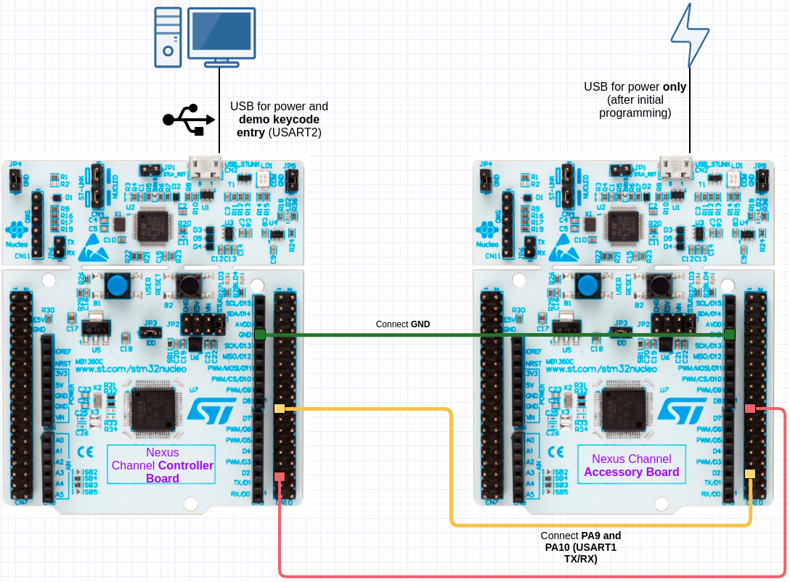

# Nexus Channel Controller Example

Sample program demonstrating the use of Nexus Channel on a "Controller" device,
running on an STM32F103RB MCU, using Zephyr RTOS.

This demo project is not standalone, and is is intended for use with the
"Nexus Channel Accessory Example" demonstration running on another, separate
board.

## Target

STM32 Nucleo-F103RB development board (STM32F103RB target), using Zephyr RTOS
for ease of demonstration and modification.

This project relies on features of the Nucleo development board,
specifically the virtual COM port provided by the ST-Link on that board.
This port is used to transfer data between the development board and a
host computer running a serial terminal at **115200 Baud**, 8N1 UART.

On Linux, this *typically* shows up as a serial port at `/dev/ttyACM0` after
the Nucleo-F103RB is connected via USB.

## Setup Steps

1. [Install PlatformIO IDE in VSCode](https://platformio.org/install/ide?install=vscode)
2. Clone this Github repository
3. Open the PlatformIO IDE and select "Open Project"
4. Open the project by selecting the directory named "Nexus_Channel_Controller_F103RB"
5. Connect your Nucleo-F103RB board to a USB port on your computer
6. Open the PlatformIO perspective in the IDE, and then click "Clean"
7. Wait until the Clean is completed, and then click "Build"
8. Wait until the Build is completed, and then click "Upload and Monitor"
9. Wait until the Upload is complete and observe the Terminal in the IDE. It should prompt for input
10. Go to the steps specific to the demonstration build you are running (below)

## Build/Run

This example is configured as a [PlatformIO](https://platformio.org/install) project.
You can optionally download PlatformIO, download this example project, and
import it using the "Add Existing" functionality in PlatformIO. This will
allow you to modify, build, and download the code onto your own
Nucleo-F103RB development board.

A minimal console is configured so that when the F103RB board
is initially booted up, `---Nexus Channel Controller Demonstration---` will be
printed to the terminal (on the virtual COM port connected to USART2).
This can be used to confirm that the board is powered and connected correctly.

Additionally, a prompt indicating `demo> ` will allow text input via the USART2
console (such as keycode entry). This functionality is implemented by the
`demo_console` module.

Functions required to be implemented by the product in order for Nexus to work
properly are contained in the `src/nxp_reference_implementations` folder.

Operationally, the demonstration program is structured into two primary Zephyr threads:

1. `main` thread. This executes the `main` function in `main.c`, and is used
to initialize product and Nexus functionality, as well as handle user input
from the `demo_console`.

2. `process_nexus` thread. This thread calls `nx_common_process`, and will
be woken up and called whenever `nxp_common_request_processing` is called by
the Nexus library to request processing. Any CPU intensive operations
performed by Nexus are done in this thread (to avoid long-running operations
in interrupts).

A background `logging` thread is also compiled in by default, which can be
disabled by setting `CONFIG_LOG=n` in `zephyr/prj.conf`. If this is disabled,
much of the demonstration functionality via USART2 console may be nonfunctional.
However, disabling logging will reduce RAM and flash use.

The default Zephyr `idle` thread is also present, which takes care of putting
the CPU into a low-power state when there is no work to process.

Development boards other than the ST Nucleo-F103RB may be supported
(but are not tested or formally supported), and may be used by modifying the
appropriate section of the `platformio.ini` file and relevant overlay files
in the `zephyr` folder. Please contact Angaza for more information on porting
the Zephyr example to other boards/MCUs.

## Demo: "Nexus Controller" Standalone PAYG Credit/Keycode

('nucleo_f103rb-keycode-only' PlatformIO build)

This build demonstrates a device acting as a "Nexus Channel Controller",
accepting keycode input from the demo console on USART2, and printing feedback
to the same console. It demonstrates the following implementation details:

* A nonvolatile storage abstraction to write/read data to flash NV (`flash_filesystem`)
* Implementation of Nexus PAYG ID/key provisioning and storage (`product_nexus_identity`)
* Implementation of product-side PAYG credit storage (`product_payg_state_manager`)
* Implementation of `nxp_keycode`, `nxp_channel` and `nxp_common` product-side functions
* Sending/Receiving Nexus Channel messages on USART1

This demo is meant to be run alongside the "Nexus Channel Accessory" demo,
where both boards are connected via their USART1 ports. 

### Suggested Demonstration Step

The `demo_console` is already configured to expect user input beginning with
`*` as a Nexus Keycode. The keycodes below assume demonstration keycode and
channel secret keys of `0xDE, 0xAD, 0xBE, 0xEF, 0x10, 0x20, 0x30, 0x40, 0x04, 0x03, 0x02, 0x01, 0xFE, 0xEB, 0xDA, 0xED`
(already configured in this example program).

#### Local Credit Management

First, demonstrate that the controller device acts as an independent PAYG
device by using basic Nexus keycodes:

* Type `*10029054295608#` ("Add Credit", 24 hours, ID=1), notice "New/applied" keycode feedback.
* Type `pc`, see remaining PAYG credit is 86400 seconds (24 hours).
* Type `*10029054295608#`, notice "Old/duplicate" keycode feedback.
* Type `*31145334081050#` ("Wipe IDs+Credit", ID=61), notice "New/applied" keycode feedback.
* Type `pc`, see remaining PAYG credit is 0 seconds.
* Enter `*10029054295608#`, again notice "New/applied" keycode feedback.
* Type `pc`, see remaining PAYG credit is 86400 seconds (24 hours).
* Type `*09544754240514#` ("Unlock", ID=15), see "New/applied" keycode feedback.
* Type `pc`, see remaining credit is 'unlocked'.
* Cycle power, type `pc`, confirm PAYG credit is still unlocked.

Notice especially the `product_payg_state_manager` module, which *receives and stores*
changes to credit from Nexus via `nxp_keycode` functions, and *reports* the
current credit back to Nexus via `nxp_common` functions.

#### Nexus Channel Secure Link, Mirrored PAYG Credit (Physical Boards)

Next, physically connect a "Nexus Channel Accessory" to this device on USART1,
and initiate a Nexus Channel secure link between the devices.

**Establishing Secure Nexus Channel Link**

* Program a separate F103RB dev board with the "Nexus Channel Accessory" example
* Connect the GND pins on the Controller and Accessory boards
* Connect PA9 on the Controller board to PA10 on the Accessory board
* Connect PA10 on the Controller board to PA9 on the Accessory board

See the interconnection diagram for reference:

* In the console on Controller, type `*815417654470589#`. This is a command
to establish a Nexus Channel Link with an accessory that has the channel key
"0xAA 0xBB 0xCC 0xDD 0xEE 0xFF 0x11 0x22 0x33 0x44 0x55 0x66 0x77 0x88 0x99 x00".
* The logs should display "Nexus Channel origin command *accepted*."
* `nxp_channel` logs will indicate an outbound MULTICAST message, and
a response message from the accessory. This is the 'link handshake' message,
used to set up a secure link with a specific accessory.
* Note: If no accessory is connected, the controller will continue trying
to send the 'link handshake' periodically for an hour before giving up.
* Once the accessory receives and validates the message, it will finish
the handshake.
* **At this point, the accessory will be 'linked' to the Controller, and
the built-in PAYG credit management will use the secure link to mirror
the Controller PAYG credit onto the accessory**.
* Enter the keycode `*815417654470589#` again. The logs will indicate that
this keycode is rejected (already used).

**Erasing a Secure Channel Link - Controller Initiated**

This procedure can only be done after completing "Establishing Secure
Nexus Channel Link" successfully.

* Enter `*81023856304#` into the Controller console. This command will
'erase' all Nexus Channel links from the controller.
* The logs should display "Nexus Channel origin command *accepted*".
* After the link is erased, the accessory will lose its PAYG credit as well
(go to '0' credit remaining).

**Erasing a Secure Channel Link - Accessory Initiated**

This procedure can only be done after completing "Establishing Secure
Nexus Channel Link" successfully.

* Press the blue button labeled "USER" on the STM32F103RB dev board running
the "Accessory" program. This button is programmed as the "Nexus Channel Link
Reset" button.
* The accessory will erase its Nexus Channel link, and as a result its
PAYG credit will go to 0.

**Resetting Controller Nexus NV**

It is normally not possible to 're-enter' Nexus Channel origin command keycodes.
However, this demo project implements a console command to erase and
reinitialize the Nexus NV/flash section. Type `erasenv` at the console, and
the Nexus Channel Origin Command keycodes listed above will be usable again.

## Nexus Channel Secure Link, Mirrored PAYG Credit (Renode)

[Renode](www.renode.io) can be used to run the "Nexus Channel Controller" and
"Nexus Channel Accessory" firmware on virtualized STM32F103RB development
boards, and simulate communication between them using USART1.

This allows a demonstration of the Nexus Channel Secure Link functionality
if you do not have access to physical development boards.

XXX TODO

# Nexus通道控制器示例

演示在“控制器”设备上使用Nexus Channel的示例程序。
运行在STM32F103RB单片机上，使用Zephyr RTOS。

此演示项目不是独立的，并且旨在与
“Nexus通道附件示例”演示运行另一个，单独
董事会。

# #目标

STM32 Nucleo-F103RB开发板(STM32F103RB目标)，采用Zephyr RTOS
为了便于演示和修改。

这个项目依赖于Nucleo开发板的特点，
特别是该板上ST-Link提供的虚拟COM端口。
该接口用于开发板和主板之间的数据传输
主机运行一个串行终端在**115200波特，8N1 UART。

在Linux上，这*通常*显示为' /dev/ttyACM0 '后面的串行端口
Nucleo-F103RB通过USB连接。

##设置步骤

1. [在VSCode中安装PlatformIO IDE](https://platformio.org/install/ide?install=vscode)
2. 克隆这个Github存储库
3.打开PlatformIO IDE，选择“Open Project”
4. 通过选择名为“Nexus_Channel_Controller_F103RB”的目录打开项目。
5. 将Nucleo-F103RB板连接到计算机上的USB端口
6. 在IDE中打开PlatformIO透视图，然后单击“Clean”。
7. 等待直到Clean完成，然后点击“Build”
8. 等待直到Build完成，然后单击“Upload and Monitor”。
9. 等到上传完成后，在IDE中观察终端。它应该提示输入
10. 转到您正在运行的演示构建特定的步骤(如下)

# #构建/运行

本例配置为[PlatformIO](https://platformio.org/install)项目。
您可以选择下载PlatformIO、下载这个示例项目和
使用PlatformIO中的“添加现有”功能导入它。这将
允许您修改、构建和下载您自己的代码
核子- f103rb开发板。

配置一个最小的控制台，以便当F103RB单板
初始启动时，“――Nexus Channel Controller Demonstration――”将是
打印到终端(连接USART2的虚拟COM端口上)。
这可以用来确认单板上电和连接正确。

此外，指示“demo>”的提示符将允许通过USART2输入文本
控制台(如键码入口)。此功能由
“demo_console”模块。

为使Nexus工作，产品需要实现的功能
正确地包含在' src/nxp_reference_implementations '文件夹中。

在操作上，演示程序被构造成两个主要的Zephyr线程:

1. 主要的线程。这将执行' main.c '中的' main '函数，并被使用
初始化产品和Nexus功能，以及处理用户输入
从' demo_console '。

2. process_nexus线程。这个线程调用' nx_common_process '，并将
调用' nxp_common_request_processing '时，将被唤醒并调用
请求处理的Nexus库。任何CPU密集型操作
由Nexus执行的操作都在这个线程中完成(以避免长时间运行的操作)
在中断)。

默认情况下，还会编译一个后台' logging '线程，它可以是
通过在' zephyr/prj.conf '中设置' CONFIG_LOG=n '来禁用。如果此选项被禁用，
通过USART2控制台的许多演示功能可能是无效的。
但是，禁用日志记录将减少RAM和闪存的使用。

默认的Zephyr ' idle '线程也存在，它负责放置
当没有工作要处理时，CPU进入低功耗状态。

可支持ST Nucleo-F103RB以外的开发板
(但没有经过测试或正式支持)，并且可以通过修改
' platformio.ini '文件的适当部分和相关的覆盖文件
在“zephyr”文件夹中。有关移植的更多信息，请联系Angaza
Zephyr示例到其他板/ mcu。