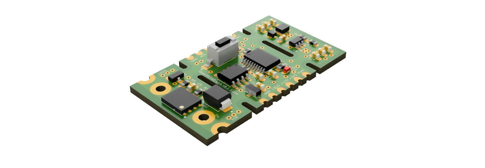

# OpenPAYGO Link

## What is OpenPAYGO Link?

OpenPAYGO Link (OPLink) is an open-source communication protocol for interfacing Solar Home Systems (SHS) with appliances and accessories. It allows you to easily make your SHS and appliances communicate with each other for features such as PAYGO locking of appliances, load-scheding, monitoring, etc. It includes both the hardware and software components needed to achieve communication from one SHS to multiple appliances over a single wire. 

## Key Features

* Very small footprint, can run on very restricted devices (e.g. STM8 with 1kB RAM and 8kB Flash)
* Half-duplex communication over a single wire with a multi-drop connection topology 
* Ensures reliable data transmission, even with different ground potentials between nodes 
* Supports variable-length payload 
* Supports standard request/reply and broadcast (to send requests to all appliances at once)
* The SHS (master) can automatically discover new appliances (slaves) and assign them a local address
* Slave nodes can instantly detect that they have been disconnected
* Slave nodes can directly send messages to the master (no need for polling from the master) 

It was designed to be used with Nexus Channel Core (based on the Open Connectivity Foundation communication standard) that provides standard resource model for common use cases. However, it is flexible enough that it can  be used with other application layers. 

**Limitations:**

There are a few limitations that are the result of compromises to keep the system as lightweight as possible. 

* The system is not intended to transmit large amount of data
* A node can only handle one request at a time
* The system can be slow if there are a lot of slaves on the bus
* The master needs to poll the appliances to detect that they have been disconnected

## Getting Started

This repository has resources to help you get started with adding OpenPAYGO Link to your SHS and/or appliance. There are a few options depending on your stage of development: 

**1. The STM8-based development board:** this small PCB includes the hardware required for OpenPAYGO Link (MCU + transceiver) as well as a buck converter to supply power from the power line, a switch controlled by the MCU, a push-button and an LED to facilitate testing. It is provided with an example firmware to get you started quickly (see ["Examples"](Examples/)). You can just drop the dev board into a prototype to have it control the switch in an appliance. 

**2. The STM8-based addon board:** this small PCB includes the bare minimum required for OpenPAYGO Link. You can add this addon board to an existing PCB as a way to quickly add OpenPAYGO Link to your system while not making any changes to the main MCU of your system. The addon board communicates with your main MCU through a simple GPIO to make it as easy as possible to use as all of the OpenPAYGO Link system is handled by the addon board. It is also provided with an example firmware (see ["Examples"](Examples/)). 

**3. Adapt the library for your main MCU:** This is the most cost efficient method as it does not require a secondary MCU just for OpenPAYGO Link. However, it requires more engineering as you need to develop some hardware abstractions to allow the OpenPAYGO Link library to use your device (see ["OPL"](OPL/)). This also requires your MCU to be compatible with 9-bit multiprocessor UART, which is very common but some MCU might not be supported. We keep a list of some MCUs known to be compatible with OpenPAYGO Link [here](Documentation/compatible_mcus.md). 
 
 

*OpenPAYGO Link STM8 Development Board* 
 
 
## What's next? 

As the core of the features are implemented, we will focus our future efforts in adding more examples to help make it easier to adopt OpenPAYGO Link even for more complex use cases. In particular, we will focus on adding an example development board and addon board based on STM32 that will showcase more advanced use cases with more Nexus Channel Core endpoints and provide a basis to start more complex projects. 

We are welcoming external contribution to the projects, and we would be very happy to accept pull requests for implementation on any other MCU targets to make it easier for people to add OpenPAYGO Link to their main MCU as quickly as possible. 

You can track all of the new features and changes to the project in the [Changelog](CHANGELOG.md). 

# OpenPAYGO链接

什么是OpenPAYGO链接?

OpenPAYGO Link (OPLink)是一种开源通信协议，用于将太阳能家庭系统(SHS)与电器和配件连接起来。它允许您轻松地使您的SHS和设备相互通信，以获得诸如设备的PAYGO锁定，负载调度，监控等功能。它包括硬件和软件组件，需要通过一条线实现从一个SHS到多个设备的通信。

##主要特性

* 占用空间非常小，可以在非常受限的设备上运行(例如，具有1kB RAM和8kB Flash的STM8)
* 半双工通信在单线与多滴连接拓扑
* 确保可靠的数据传输，即使节点之间有不同的接地电位
* 支持可变长度负载
* 支持标准请求/应答和广播(一次向所有设备发送请求)
* SHS(主)可以自动发现新的设备(从)，并分配一个本地地址
* 从节点可以立即检测到它们已断开连接
* 从节点可以直接向主节点发送消息(不需要从主节点轮询)

它被设计为与Nexus Channel Core(基于开放连接基金会通信标准)一起使用，该标准为常见用例提供了标准的资源模型。然而，它足够灵活，可以与其他应用层一起使用。

* *限制:* *

有一些限制是为了使系统尽可能轻量级而妥协的结果。

*本系统不用于传输大量数据
一个节点一次只能处理一个请求
*如果总线上有很多从机，系统可能会很慢
*主机需要轮询设备以检测它们是否已断开连接

##开始

这个存储库有资源可以帮助您开始将OpenPAYGO Link添加到您的SHS和/或设备。根据你的发展阶段，有一些选择:

* * 1。基于stm8的开发板:**这个小PCB包括OpenPAYGO Link (MCU +收发器)所需的硬件，以及从电源线供电的降压转换器，由MCU控制的开关，按钮和LED，以方便测试。它提供了一个示例固件，让您快速入门(参见[“示例”](示例/))。你可以将开发板放入原型中，让它控制设备中的开关。

* * 2。基于stm8的附加板:**这个小PCB包括OpenPAYGO Link所需的最低限度。您可以将此附加板添加到现有的PCB上，以便快速将OpenPAYGO Link添加到系统中，而无需对系统的主MCU进行任何更改。附加板通过简单的GPIO与主MCU通信，使其尽可能易于使用，因为所有的OpenPAYGO Link系统都由附加板处理。它还提供了一个示例固件(参见[“示例”](示例/))。

* * 3。为您的主MCU调整库:**这是最具成本效益的方法，因为它不需要仅用于OpenPAYGO Link的辅助MCU。然而，它需要更多的工程，因为你需要开发一些硬件抽象，以允许OpenPAYGO链接库使用你的设备(见[“OPL”](OPL/))。这也要求您的MCU与9位多处理器UART兼容，这是非常常见的，但一些MCU可能不支持。我们保留了一些已知与OpenPAYGO兼容的mcu列表链接[在这里](Documentation/compatible_mcus.md)。

[OpenPAYGO Link STM8开发板](Documentation/images/dev_board.png)
*OpenPAYGO Link STM8开发板*

下一步是什么?

随着核心功能的实现，我们将把未来的努力集中在增加更多的例子上，以帮助更容易地采用OpenPAYGO Link，即使是在更复杂的用例中。特别是，我们将专注于添加基于STM32的示例开发板和附加板，这将展示更多Nexus通道核心端点的更高级用例，并为启动更复杂的项目提供基础。

我们欢迎外部对项目的贡献，我们非常乐意接受在任何其他MCU目标上实施的拉取请求，以使人们更容易尽快将OpenPAYGO链接添加到他们的主MCU中。

您可以在[Changelog](Changelog .md)中跟踪项目的所有新特性和更改。